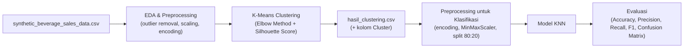

# 🧃 Customer Segmentation & Classification — Beverage Sales Data


Proyek *machine learning* end-to-end yang menggabungkan **Unsupervised Learning** dan **Supervised Learning**: data transaksi penjualan minuman disegmentasi menggunakan **K-Means Clustering**, lalu label hasil segmentasi tersebut dipakai sebagai target untuk melatih model **klasifikasi (KNN)**.

---

## 📖 Daftar Isi

- [Ringkasan Proyek](#-ringkasan-proyek)
- [Alur Kerja](#-alur-kerja)
- [Struktur Proyek](#️-struktur-proyek)
- [Dataset](#-dataset)
- [Instalasi](#️-instalasi)
- [Cara Menjalankan](#-cara-menjalankan)
- [Hasil Utama](#-hasil-utama)
- [Teknologi yang Digunakan](#-teknologi-yang-digunakan)
- [Catatan & Batasan](#-catatan--batasan)
- [Author](#-author)

---

## 🔎 Ringkasan Proyek

Proyek ini mengikuti alur klasik **"cluster-then-classify"**:

1. **`[Clustering].ipynb`** — Melakukan *Exploratory Data Analysis* (EDA), *preprocessing*, dan clustering **K-Means** tanpa label pada data transaksi penjualan minuman untuk menemukan segmen pelanggan/transaksi alami di dalamnya.
2. **`[Klasifikasi].ipynb`** — Menggunakan label cluster dari tahap sebelumnya sebagai target, lalu melatih model klasifikasi **K-Nearest Neighbors (KNN)** untuk memprediksi cluster suatu transaksi baru.

Pendekatan ini berguna untuk mengubah hasil segmentasi *unsupervised* menjadi model prediktif yang bisa langsung dipakai pada data baru tanpa perlu menjalankan ulang seluruh proses clustering.

## 🔄 Alur Kerja



## 🗂️ Struktur Proyek

```
Clustering_Classification/
├── [Clustering].ipynb                    # EDA, preprocessing, K-Means clustering
├── [Klasifikasi].ipynb                   # Klasifikasi (KNN) berdasarkan hasil clustering
├── synthetic_beverage_sales_data.csv     # Dataset mentah (input awal)
├── hasil_clustering.csv                  # Output clustering, jadi input notebook klasifikasi
└── README.md
```

## 📊 Dataset

Dataset berupa data transaksi penjualan minuman (sintetis) dalam format CSV.

| Kolom | Deskripsi |
|---|---|
| `Order_ID` | ID unik pesanan |
| `Customer_ID` | ID unik pelanggan |
| `Customer_Type` | Tipe pelanggan: `B2B` atau `B2C` |
| `Product` | Nama produk minuman (47 produk unik) |
| `Category` | Kategori produk: `Water`, `Soft Drinks`, `Juices`, `Alcoholic Beverages` |
| `Unit_Price` | Harga satuan produk |
| `Quantity` | Jumlah unit yang dibeli |
| `Discount` | Diskon yang diberikan |
| `Total_Price` | Total harga transaksi |
| `Region` | Wilayah/negara bagian di Jerman (16 wilayah) |
| `Order_Date` | Tanggal transaksi (2021–2023) |

**Statistik singkat:** ±50.000 baris transaksi · 8.157 pelanggan unik · 16.766 pesanan unik · rentang waktu Jan 2021–Des 2023.

> ℹ️ Kolom `Cluster` ditambahkan secara otomatis pada `hasil_clustering.csv` sebagai output dari notebook clustering.

## ⚙️ Instalasi

Clone repository ini:

```bash
git clone https://github.com/abiyyufarhan/Clustering_Classification.git
cd Clustering_Classification
```

Install dependency yang dibutuhkan (repo ini belum menyertakan `requirements.txt`, jadi install manual):

```bash
pip install pandas numpy matplotlib seaborn scikit-learn yellowbrick jupyter
```

## ▶️ Cara Menjalankan

1. Buka `[Clustering].ipynb` di Jupyter Notebook/JupyterLab/Google Colab.
2. **Sesuaikan path dataset** pada sel pemuatan data — saat ini masih menggunakan path lokal (`D:/Dicoding/Machine Learning/Submission/...`), ganti dengan lokasi `synthetic_beverage_sales_data.csv` di komputer Anda.
3. Jalankan seluruh sel (**Run All**) hingga selesai — notebook ini akan menghasilkan `hasil_clustering.csv`.
4. Buka `[Klasifikasi].ipynb`, sesuaikan juga path menuju `hasil_clustering.csv`, lalu **Run All** untuk melatih dan mengevaluasi model klasifikasi.

## 🏆 Hasil Utama

**Clustering (K-Means)**
- Jumlah cluster optimal: **k = 2**, dipilih berdasarkan Elbow Method & Silhouette Score (ambang ≥ 0.55).
- **Cluster 0** didominasi pelanggan **B2C**, produk *Hohes C Orange* (kategori *Water*), terkonsentrasi di wilayah **Sachsen**.
- **Cluster 1** juga didominasi pelanggan **B2C**, namun dengan produk *Rauch Multivitamin* (kategori *Soft Drinks*), terkonsentrasi di wilayah **Hamburg**.

**Klasifikasi (KNN)** — memprediksi label `Cluster` dari data hasil clustering:

| Metrik | Skor |
|---|---|
| Accuracy | 71.26% |
| Precision | 72.00% |
| Recall | 72.04% |
| F1-Score | 72.02% |

Model KNN menunjukkan performa yang cukup seimbang antara precision dan recall, meski masih ada ruang untuk peningkatan lebih lanjut.

## 🧰 Teknologi yang Digunakan

- **Python 3**
- **Pandas** & **NumPy** — manipulasi data
- **Matplotlib** & **Seaborn** — visualisasi
- **Scikit-learn** — preprocessing, K-Means, KNN, metrik evaluasi
- **Yellowbrick** — visualisasi Elbow Method

## 📌 Catatan & Batasan

- Path dataset di kedua notebook masih *hardcoded* ke direktori lokal penulis — perlu disesuaikan sebelum dijalankan ulang.
- Bagian *hyperparameter tuning* (GridSearchCV/RandomizedSearchCV) pada `[Klasifikasi].ipynb` belum diimplementasikan (masih berupa placeholder).
- Model klasifikasi lain (Decision Tree, Random Forest, SVM, Naive Bayes) sudah di-*import* namun belum dilatih/dibandingkan — dapat dijadikan pengembangan lanjutan.
- Dataset bersifat sintetis dan digunakan untuk keperluan pembelajaran/latihan *machine learning*.

## 👤 Author

**Abiyyu Farhan** — [@abiyyufarhan](https://github.com/abiyyufarhan)

---

⭐ Jangan lupa beri *star* jika proyek ini bermanfaat!
